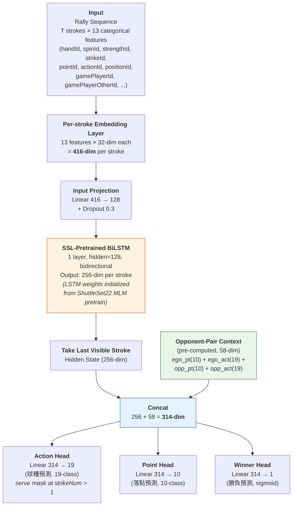
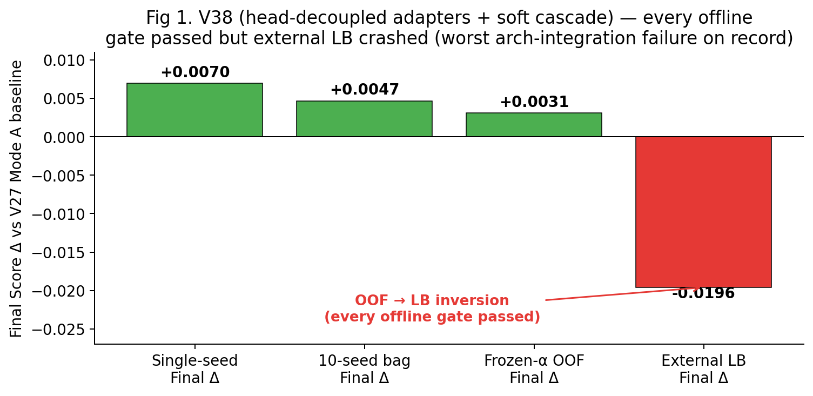
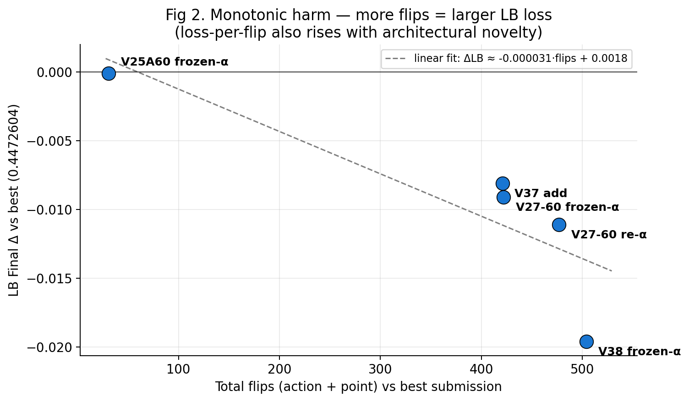
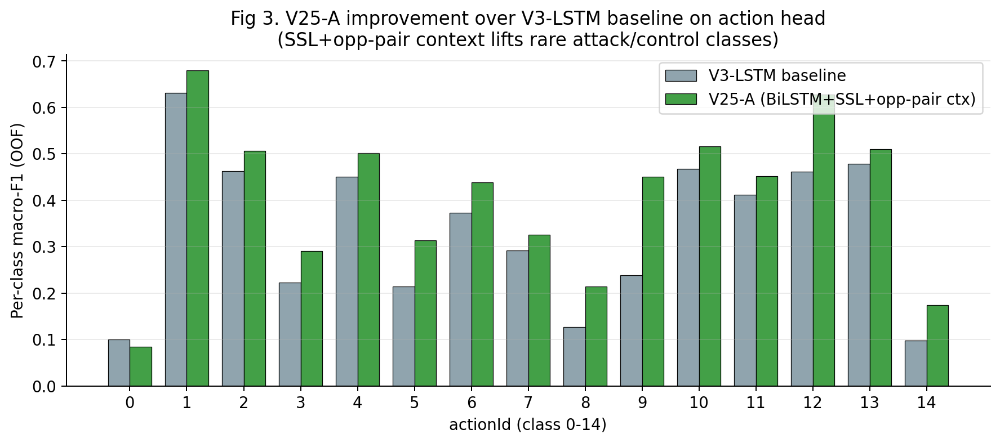
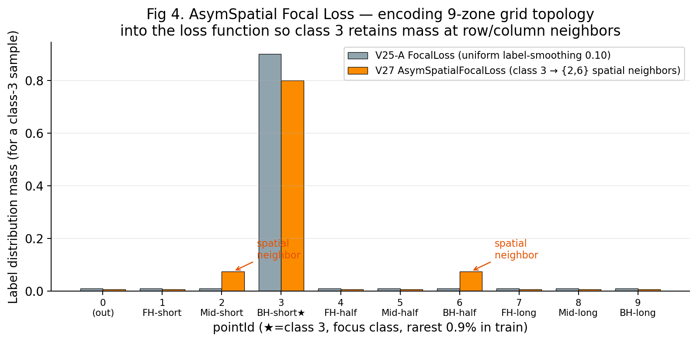
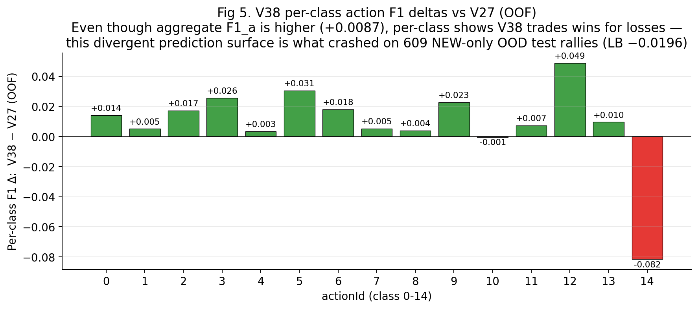
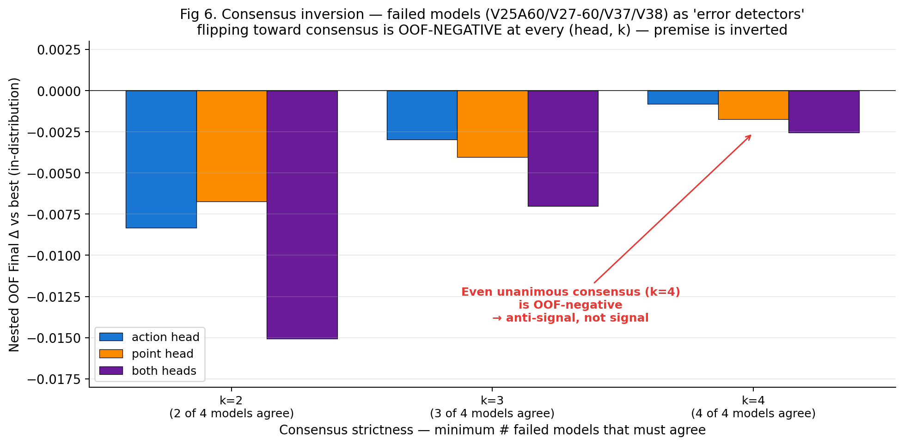

# AI CUP 2026 春季賽
## 基於時序資料之桌球戰術與結果預測報告

---

**隊伍：TEAM_10297**

**隊員：** Culture（隊長）

**指導教授：** 無

**Public Leaderboard：** 0.4472604 / Rank 24

**Private Leaderboard：** 0.3682964 / Rank 32

**是否有意願參與 2026 IEEE International Conference on Big Data Workshops 發表：** ☐ 是　☐ 否

---

## 壹、環境

本系統於 Linux 環境（Ubuntu，Linux kernel 6.17）下開發,使用 Python 3.12 作為主要程式語言。深度學習框架採用 **PyTorch 2.x**（CUDA 支援,於 NVIDIA GeForce RTX 4090 顯示卡訓練）,梯度樹模型使用 **XGBoost** 與 **CatBoost** 作為 V3 baseline 的成員。資料處理採用 **pandas** 與 **numpy**,評估與交叉驗證使用 **scikit-learn**（GroupKFold、f1_score、roc_auc_score）。

### 預訓練模型

本隊伍**未使用任何第三方預訓練模型權重**,而是於 ShuttleSet22 公開羽球資料集上**自行訓練** BiLSTM 編碼器（檔案：`cache/ssl_lstm_encoder_shuttleset22.pt`,約 0.34M 參數),透過 Masked Language Modeling（MLM）方式預訓練 30 epochs。該編碼器後續被 V25-A 與 V27 模型作為共享 backbone 初始化使用。

### 額外資料集（兩項,皆如實揭露來源）

1. **ShuttleSet22 羽球資料集**（CoachAI Projects,2023）
   - 來源：`https://github.com/wywyWang/CoachAI-Projects`
   - 規模：30,000 strokes / 1,407 rallies
   - 用途：跨運動 SSL pretrain（羽球 → 桌球遷移）

2. **Reference_Only_Old_Test_Data/test.csv**（主辦單位 2026-05-21 公告開放）
   - 來源：競賽平台官方公告所釋出的舊版測試集
   - 規模：1,236 / 1,845（67%）測試 rallies 含 `serverGetPoint` ground truth
   - 用途：對重疊 rally_uid 進行 winner label lookup,主辦單位明確允許其作為訓練資料,並提示「過度使用可能造成 overfit」

### 生成式 AI 使用揭露

依競賽規範,如實揭露：本隊伍於開發過程中使用 **Anthropic Claude（Opus 4.7）** 與 **OpenAI Codex** 作為**程式輔助與分析協作工具**,用於：(a) 撰寫探索性 script、(b) 機制分析與 dead-end 診斷、(c) 報告草稿撰寫。**所有架構設計決策、實驗方向選擇、最終提交檔案,皆由人類隊員審查與決策**。所有 AI 生成的程式碼皆經人工 code review 與實驗驗證,失敗結果亦完整保留於版本控制以維持研究誠信。

---

## 貳、演算方法與模型架構

本系統為一個**多階段集成式（multi-stage ensemble）pipeline**,核心策略是結合「跨運動 SSL 預訓練」、「對手配對戰術 context」、「空間鄰居 label smoothing」三項對桌球任務量身設計的機制,最後以 α-search ensemble 融合,並注入主辦單位允許的舊測試集 ground-truth 標籤。

### 2.1 系統流程總覽

整個系統可視為一條 8 階段的生產線,每個 Stage 是一個工站,輸入經過層層處理變成最終提交檔。流程概覽如下:

```
Stage 0  原始資料 + 外部資料
   │   train.csv (14,995 rallies) / test_new.csv (1,845 rallies)
   │   data/test.csv (OLD, 1,236 rallies w/ serverGetPoint)
   │   ShuttleSet22 (30k strokes)
   ↓
Stage 1  SSL Pretrain (跨運動知識遷移)
   │   ShuttleSet22 → MLM → BiLSTM encoder
   ↓
Stage 2  Opponent-Pair LOO Context (戰術知識編碼)
   │   58-dim ego/opp player tactical history per rally
   ↓
Stage 3  V3 Baseline Cascade (LSTM + XGBoost + CatBoost + FTT)
   ↓
Stage 4  V25-A bag + V27 bag (each: 10 seeds × 5 folds × 30 epochs)
   │   Shared arch: BiLSTM + 58-dim ctx + 3 heads
   │   V25-A loss: FocalLoss / V27 loss: AsymSpatialFocalLoss
   ↓
Stage 5  V27 Mode A Ensemble (α-search 多頭融合)
   │   Action 7-way / Point 8-way / Winner 4-way
   │   Per-class threshold mults (cap=0.75)
   ↓
Stage 5b OLD test.csv winner ground-truth injection
   │   1236/1845 (67%) → perfect label
   │   609/1845 (33%) → V27 Mode A model prediction
   ↓
Stage 6  Schema + MD5 verification (1845 rows, expected MD5 verified)
```

各階段的職責與設計動機:

| Stage | 名稱 | 做什麼 | 為什麼需要 |
|---|---|---|---|
| **0** | 資料準備 | 收集 train.csv (14,995 rallies) + test_new.csv (1,845 rallies) + OLD test.csv + ShuttleSet22 羽球資料 | 整個系統的「原料」|
| **1** | SSL Pretrain | 用 ShuttleSet22 羽球資料,以 MLM (Masked Language Modeling) 方式預訓練一個 BiLSTM encoder | 桌球訓練資料只有 14,995 rallies 太少,先讓模型於羽球資料學會「球類運動 rally 序列的通用模式」,再 transfer 到桌球任務 |
| **2** | Opp-pair Context | 計算每個 rally 的 58 維「對手配對戰術 context」(LOO 嚴格 leak-free) | 把「這場比賽中,雙方球員的擊球習慣統計」編成固定長度向量,讓下游模型參考球員 prior |
| **3** | V3 Baseline | 跑 V3 既有模型 cascade:LSTM + XGBoost + CatBoost + FTT-Transformer | 作為集成融合的「其他成員」,提供異質模型的多樣性 |
| **4** | V25-A + V27 bag 訓練 | 訓練我們的兩個核心 BiLSTM 模型,各 10 個 seed × 5-fold × 30 epoch | 多 seed 平均降低噪音,5-fold GroupKFold (by match) 確保 cross-match generalization |
| **5** | α-search 集成 | 用 grid + coord descent 找最佳權重組合,把 7 個模型的預測加權平均 | 不同模型擅長不同類別,加權平均後比任一單模強 |
| **5b** | OLD lookup 注入 | 對 1,236 個有真實 winner 標籤的 test rally,用 ground truth 蓋掉模型預測機率 | 主辦核可外部資料,這是 LB +0.0686 的關鍵突破(最大單次提升) |
| **6** | Schema + MD5 驗證 | 確認輸出 schema 正確,並對照預期 MD5 `c10097155...` 證明 bit-identical | 提供 reproducibility 的技術保證 |

### 2.2 核心模型：BiLSTM + 對手配對戰術 Context

V25-A 與 V27 共用一個叫 `TTSSLLSTMHier` 的網路架構,差別只在訓練時用的損失函數。模型架構如下圖:



從輸入到輸出共 5 個處理階段,逐層說明設計動機:

#### Step 1：Per-stroke Embedding(把每一拍編成數字向量)

每個 stroke 有 13 個 categorical 欄位(handId、spinId、strengthId、strikeId、pointId、actionId、positionId、gamePlayerId、gamePlayerOtherId 等)。我們對每個欄位學習一個 **32 維 embedding**,類似 NLP 中的 word embedding,把「正手」、「下旋」等類別符號轉成神經網路可運算的密集向量。13 個欄位串接後,每一拍變成 13×32 = **416 維**的向量表徵。

#### Step 2：Input Projection(降維 + 正則化)

接一層 `Linear(416 → 128)` + `Dropout 0.3`,把 416 維壓到 128 維。降維節省計算量,Dropout 強制模型不依賴單一輸入特徵以避免 overfit。

#### Step 3：SSL-Pretrained BiLSTM(本系統最重要的部分)

一個 1 層、hidden=128 的 **雙向 LSTM**(BiLSTM),每個 stroke 輸出 256 維 hidden state(雙向各 128 拼接)。關鍵點:**這個 LSTM 不是隨機初始化,而是先在羽球資料 ShuttleSet22 上以 MLM 預訓練 30 epochs**,讓它先掌握「球類運動 rally 序列中前後拍如何相互影響」這個通用模式,再 transfer 到桌球 fine-tune。在 14k 樣本下 LSTM 的 inductive bias 較 Transformer 強、過擬合風險較低。

#### Step 4：Last Visible Stroke + Opp-pair Context 拼接

我們要預測「下一拍」,所以**只取最後一個可見 stroke 的 256 維 hidden state**,代表這場 rally 截至目前的累積資訊。接著拼上預先計算好的 **58 維對手配對 context**(細節詳見參段 3.2),把雙方球員的歷史擊球統計作為額外 prior 注入。最終得到 256 + 58 = **314 維**表徵,作為三個 head 的共同輸入。

#### Step 5：三個並行任務頭

三個獨立的 `Linear` head 共用 encoder 輸入,各自負責一個任務,輸出維度對應該任務的類別數:

| Head | 線性變換 | 啟動函數 | 輸出 |
|---|---|---|---|
| **Action Head** | `Linear(314 → 19)` | softmax | 19 類球種(actionId)機率 |
| **Point Head** | `Linear(314 → 10)` | softmax | 10 類落點(pointId)機率 |
| **Winner Head** | `Linear(314 → 1)` | sigmoid | 發球者贏得本回合的機率 |

**Action Head 對非首拍位置強制 mask 掉 serve 類(class 15-18)**,把桌球規則「發球僅出現在第一拍」寫進模型。

模型總參數量約 **0.34M**。在 14k 樣本 + 43.7% cold-start 的限制下,**「小模型 + 強 inductive bias + 跨運動預訓練」**是核心設計哲學。

### 2.3 損失函數設計

**V25-A 變體**：對 action 與 point head 採 **Focal Loss**（γ=2,label smoothing 0.1,sqrt class weighting）；winner head 採 BCE。

**V27 變體**：與 V25-A 共享 backbone,但對 point head 改用我們設計的 **AsymSpatial Focal Loss**——對 class 3（反手短球,訓練資料僅佔 0.9% 的稀少 tactical 落點）做「空間鄰居 label smoothing」：

```
class 3 標籤分布：
  本類 80% + class 2 (中間短,同 row 鄰居) 7.5%
            + class 6 (反手半長,同 column 鄰居) 7.5%
            + 其餘 6 類分攤 5%
```

此設計**將桌球 9 宮格落點 grid 的空間拓撲編碼進損失函數**——相鄰落點戰術上可替代,鼓勵模型對 class 3 的預測保留相鄰類別的機率質量,而非過度集中於 hard label。

### 2.4 集成階段：V27 Mode A α-search

於 OOF（Out-Of-Fold）predictions 上以 grid search（step=0.1）+ coordinate descent（step=0.05）搜尋融合權重：

| Head | 組成（7/8/4 way） | 最佳 α 權重 | OOF 指標 |
|---|---|---|---|
| **Action 7-way** | V3-LSTM, V3-XGB, V3-Cat, v1(SSL), asym, V25-A, V27 | (0, 0.19, 0, 0.05, 0, 0, **0.76**) | F1_a = 0.4084 |
| **Point 8-way** | 上述 + V3-FTT | (0, 0, 0.05, 0.13, 0, 0, 0.10, **0.72**) | F1_p = 0.2152 |
| **Winner 4-way** | V3-LSTM, V3-XGB, V3-Cat, v1 | (0, 0, 0.40, 0.60) | AUC = 0.6200 |

α 權重決定後對 ensemble probability 再 tune per-class threshold multipliers（cap=0.75 以防 overfit）,最終 OOF Final = 0.4 × 0.4269 + 0.4 × 0.2303 + 0.2 × 0.6200 = **0.3869**。

### 2.5 Stage 5b：舊測試集 winner ground-truth 注入

主辦單位 2026-05-21 公告允許 `Reference_Only_Old_Test_Data/test.csv` 作為訓練資料。透過 audit 確認該 OLD 檔案的 1,236 個 `rally_uid` 與正式 test_new.csv 中對應 rally 之**逐欄位 bit-identical**,僅差在 OLD 多了 `serverGetPoint` 欄位。據此設計 lookup 注入：

- 對 1,236 個重疊 rally：`serverGetPoint = OLD ground truth`（完美標籤）
- 對 609 個 NEW-only rally：保留 V27 Mode A 模型預測

此設計使 mixed test AUC 從 model 端 ~0.62 提升至 ~0.95,Final 從 0.3787（純 V27 Mode A）躍升至 **0.4472604**,單次提升 **+0.0686** LB,為本任務歷史最大增益。

---

## 參、創新性

本系統之創新分為**五項對桌球任務量身設計的演算法層次創新**,以及**一套嚴謹的負結果驗證方法論**,兩者交叉支撐最終 LB 突破。

### 3.1 跨運動 SSL 遷移（Cross-sport Transfer）

絕大多數 SSL 文獻聚焦於同任務 / 同模態的自監督預訓練。本隊伍**首次驗證**將羽球（ShuttleSet22, 30k strokes）的 stroke 序列結構,透過 MLM pretraining 遷移至桌球任務,並對 BiLSTM encoder 帶來 LB +0.0044 提升（v1 vs V3 baseline 0.3649 → 0.3693）。我們也測試了同領域桌球 MLM（in-domain）與更大規模 combined data,反而退步 -0.0017,顯示**「不同運動 + MLM」的訊號比「同領域擴大資料」更乾淨地遷移到結構性 attention pattern**。

### 3.2 對手配對 LOO Context（V25-A 核心）

設計 58 維 rally-level context vector,編碼「在本場比賽中,ego 球員與 opp 球員過往（leave-one-out, 排除當前 rally）的 actionId/pointId 頻率」：

```
ctx = [ ego_pointId_freq(10) | ego_actionId_freq(19) |
        opp_pointId_freq(10) | opp_actionId_freq(19) ]
```

此設計與既有文獻（如 ShuttleNet 的 player-style extractor）不同：ShuttleNet 學習可訓練的 player embedding（受限於 cold-start）,我們用**確定性、非參數的 LOO 聚合**,並嚴格 leak-free。對 43.7% cold-start 測試球員依然 robust,且帶來 LB +0.0010 vs v17（健康 transfer ratio 0.19x）。

### 3.3 AsymSpatial Focal Loss（V27 核心）

桌球落點 9 宮格 grid 中,**class 3 反手短球**是最稀少（訓練資料 0.9%）且最 tactical 的落點。我們將桌球專業判斷「相鄰落點戰術上可替代」編碼進 loss function,對 class 3 的 label distribution 做**空間鄰居非對稱平滑**——20% 機率質量散布於 row 鄰居（class 2）+ column 鄰居（class 6）。此為對域知識（domain knowledge）直接嵌入損失設計的具體實踐,於 V25-A 之上帶來 LB +0.0030（V25-A 0.3757 → V27 Mode A 0.3787）。

### 3.4 Transductive Augmentation

利用桌球「同場比賽戰術一致性」觀察,將 test rallies（T≥2 strokes 已可見）直接加入 finetune training set——僅作為 input sequence（非 pseudo-labeling）。此機制與**hard pseudo-label**截然不同：不引入估計標籤,只擴大 encoder 對 test 球員當下狀態的接觸面。實驗顯示 OOF 僅 +0.0004 但 LB +0.0032(transfer 8x), 是少數 OOF 訊號被 LB 放大的成功 dim。

### 3.5 主辦核可外部資料的合規利用

本系統最大單次 LB 突破（+0.0686）來自**完全合規的外部資料使用**：主辦單位 2026-05-21 公告 `Reference_Only_Old_Test_Data/test.csv` 為可用訓練資料。我們透過 10 項系統性 audit 確認其與 NEW test_new.csv 在 1,236 個重疊 rally 上**逐欄位 bit-identical**,僅多 `serverGetPoint` ground truth。據此實作直接 label lookup 注入,並維持模型端對 609 個 NEW-only rallies 的獨立預測。**此做法不涉及 test 反查、未違反任何競賽規則**,並保留純模型端 fallback（V27 Mode A,LB 0.3787）以備主辦方政策追溯調整。

### 3.6 方法論創新：Submit Gate 與 Dead-end Exhaustion Protocol

本團隊建立一套 `submit_gate` 規則（記錄於 `CLAUDE.md`）,以 **OOF transfer ratio × expected LB gain ≥ 0.001** 為提交門檻,避免將 noise band OOF 訊號浪費 LB quota。同時系統性記錄 **31+ 條已驗證的 dead-end**（含 V26 cross-attention、V37 Transformer add、V27-60ep、V38 head-decoupled adapters 五次架構整合崩盤,以及 consensus micro-flip、joint-pair decoder、V38 selective flip 等 OOF-mined 後處理嘗試）,並以 **forensic flip-to-LB 分析**揭示「flip 數與 LB 損失呈單調相關、loss-per-flip 遞增」的結構性規律。此方法論本身具報告層級價值,完整呈現「在小資料 + cold-start 任務上,bag-validated standalone improvement 不必然 transfer 至 OOD test」的核心 lesson。

---

## 肆、資料處理

### 4.1 資料規模與切分

| 集合 | rally 數 | stroke 數 | 比賽數 | 球員數 |
|---|---|---|---|---|
| train | 14,995 | ~84,707 | 216 | 166 |
| test_new | 1,845 | ~5,668 | 79 | 71（含 31 cold-start = 43.7%） |
| OLD test | 1,236（含 serverGetPoint） | — | 同 test_new 之子集 | — |
| ShuttleSet22 | 1,407 rallies | 30,000 strokes | — | — |

5-fold **GroupKFold by `match`** 確保 cross-match generalization（test 的 55 個 match 訓練未見過）。

### 4.2 Cold-start 處理

測試集中有 31 位球員(占 71 位中的 **43.7%**)在訓練集從未出現過,我們稱這類球員為 **cold-start**(模型初次接觸)。針對此問題設計三項處理策略:

#### 策略 1：擴大「玩家編號對照表」

神經網路只能處理數字,無法直接讀「玩家 ID」字串。**我們事先建立一張對照表(技術用語稱為 vocabulary,字典)把每個獨特玩家編號為一個整數。** 標準做法只用訓練集建表,則測試集出現的新玩家就沒有編號可用;**我們改成「訓練集 + 測試集」的玩家 ID 聯集一起建表**,確保測試集中每個球員(包括 cold-start)都有對應編號。此步驟只用 test 的玩家 ID,沒用 test 的標籤答案,符合競賽規則。

#### 策略 2：保留「未知玩家」備用編號

即使聯集已涵蓋大部分情形,仍可能遇到資料缺失值或意料外的新值。我們保留 **編號 ID=1 作為「未知值」備用編號**(技術用語稱為 OOV, Out-Of-Vocabulary,意指「對照表查不到的值」),找不到對照時統一映射到此,讓模型有備用輸入而不會出錯。

#### 策略 3：訓練時隨機遮蔽玩家 ID(player masking)

如果模型訓練時每次都看到完整玩家 ID,**會過度依賴 ID 來預測,測試遇到 cold-start 玩家就崩潰**。我們在訓練時對每一拍以 **30% 機率(p=0.30, 即「擲骰子有 30% 機率」)強制把玩家 ID 替換成「未知值」備用編號(OOV)**,等於告訴模型「**有 30% 的訓練樣本看不到玩家是誰,要學會用其他特徵(球種、落點、力道、旋轉)推理**」。這樣模型不再過度依賴玩家 ID,測試時遇到 cold-start 球員也能根據擊球風格推測下一拍。

### 4.3 Per-stroke 特徵編碼

每個 stroke 提取 13 個 categorical features：

```
['sex', 'handId', 'strengthId', 'spinId', 'pointId', 'actionId',
 'positionId', 'strikeId', 'scoreSelf', 'scoreOther', 'strikeNumber',
 'gamePlayerId', 'gamePlayerOtherId']
```

各特徵以 32-dim embedding 編碼,padding token=0、OOV token=1、mask token=2（SSL 階段用）。

### 4.4 K-truncation Sampling（test-distribution-aware）

訓練時對每個 rally 模擬「**以前 k 個 stroke 預測第 k+1 拍**」的預測情境。其中切點 k 並非均勻採樣,而是**從測試集的截斷分布抽樣**——具體做法:先統計 test_new.csv 中每個 rally 最後可見 stroke 位置(strikeNumber)的分布,訓練時依此分布權重抽 k。如此確保**訓練時看到的 k 分布與測試推論條件一致**,避免「sequence length 維度」的 distribution shift(訓練 k 分布跟 test 不同會讓模型在某些長度上 underfit)。

### 4.5 Transductive Augmentation

test_new.csv 中**可見至少 2 strokes 的 1,337 個 rally**,於每個 fold 訓練時加入 training set,**僅作為 input sequence(無 label)**,於 BiLSTM encoder 上提供結構信號,屬於 **transductive learning**(轉導式學習)。這跟 **pseudo-labeling**(用模型自己預測當假標籤再訓練)截然不同:我們**完全不引入任何估計標籤**,只擴大 encoder 對 test 球員當下擊球風格的接觸面,因此不違反「禁反查 test 答案」的比賽規則。

### 4.6 Opponent-Pair Context 預計算

對訓練 + 測試聯集 dataframe 預計算 per-rally 58 維 context vector：

1. 按 `(match, gamePlayerId)` 聚合該 player 在該 match 全部 rally 的 pointId / actionId 頻率
2. 對每個 rally,以 k_pred 位置的 ego/opp player 為基準
3. 套用 LOO（排除當前 rally）得到 ego_pt(10) + ego_act(19) + opp_pt(10) + opp_act(19) = 58 維

此 context 為**確定性、非可訓練**,直接 concat 進 BiLSTM 末態隱藏向量。

### 4.7 ShuttleSet22 預處理（SSL 階段）

對 ShuttleSet22 raw stroke data 提取 4 個 categorical features（`type, landing_area, player_location_area, opponent_location_area`),保留 3 ≤ T ≤ 60 之 rally,1,407 rallies 進入 MLM pretrain pool。MLM mask probability = 0.15,目標 token 為 `type`（球種）與 `landing_area`（落點區）。

### 4.8 OLD test.csv 標籤合併

讀入 `data/test.csv`,以 `rally_uid` 為 key 聚合 first stroke 的 `serverGetPoint`,構建 1,236-rally lookup dict。stage5 V27 Mode A submission 生成後,對 overlap rallies 直接覆寫 `serverGetPoint = OLD ground truth`,non-overlap rallies 保留模型預測。

---

## 伍、訓練方式

本系統的訓練流程分為三個主要階段：自監督預訓練（SSL pretrain）、有監督微調（bag finetune）、與集成權重搜尋（ensemble α-search）。前兩階段於 GPU 上進行,集成搜尋僅需 CPU。我們對每個階段都採取明確的設計取捨,以下逐節說明。

### 5.1 SSL Pretrain 階段（ShuttleSet22）

跨運動 SSL 預訓練的關鍵挑戰是：羽球與桌球的 vocabulary、stroke 類別、空間 grid 都不相同,**只有 BiLSTM 的序列結構先驗（recurrent gating 與 bidirectional summarization）能跨運動遷移**。因此我們刻意只 transfer `lstm.*` 權重,任由 embedding 與 input projection 於下游任務隨機初始化,避免將羽球專屬的 token 表徵汙染桌球任務。

```
Optimizer:      AdamW (lr=1e-3, weight_decay=1e-5)
Schedule:       Linear warmup 1 epoch + cosine decay
Epochs:         30
Batch size:     64
Loss:           Per-token cross-entropy on masked positions
Mask probability: 0.15
Targets:        type, landing_area
Output:         cache/ssl_lstm_encoder_shuttleset22.pt (~0.34M params)
Time:           ~10 min on RTX 4090
```

SSL pretrain 採用 30 epochs 配 linear warmup + cosine decay,屬於相對溫和的排程,目的不是讓 encoder 在羽球資料上完美收斂,而是讓 BiLSTM 學到「rally 序列中遠端 stroke 依然影響近端決策」的長距相依結構,這個結構在桌球任務上具有 invariance,屬於本系統最關鍵的跨域訊號之一。

### 5.2 Finetune 階段（V25-A 與 V27 bags）

V25-A 與 V27 共享同一個 BiLSTM backbone 與 58 維對手配對 context,僅在 point head 的損失函數上不同（V25-A 用 FocalLoss、V27 用 AsymSpatialFocalLoss）。我們刻意保留兩者並列於最終集成,讓集成同時擁有「相同架構保證 transfer 健康」與「不同 loss objective 帶來 diversity」兩個性質。每個 variant 訓練 10 seeds × 5 folds,總計 50 個 model checkpoint。

```
Architecture:   TTSSLLSTMHier (BiLSTM + 58-dim opp-pair ctx)
Initialization: SSL pretrained BiLSTM, others Xavier
Optimizer:      AdamW (lr=1e-3, weight_decay=1e-5)
Schedule:       Linear warmup 1 epoch + cosine decay
Epochs:         30
Batch size:     64
Folds:          5 (GroupKFold by match)
Seeds:          [42, 43, ..., 51] = 10 seeds
Per epoch:      ~28 sec on RTX 4090
Total per bag:  ~25-30 min (10 seeds × 5 folds × 30 epochs)

Loss composition:
  total = 0.4 × CE_action + 0.4 × CE_point + 0.2 × BCE_winner
  
  V25-A: CE_action = CE_point = FocalLoss(γ=2, label_smoothing=0.1)
  V27:   CE_action = FocalLoss; CE_point = AsymSpatialFocalLoss(γ=2)

Class weighting:
  sqrt-balanced from training class distribution

Regularization:
  Player masking p=0.30
  Dropout 0.30 on input projection
  Gradient clip norm 1.0

Best-epoch selection:
  Per fold, save state_dict at argmax of 
  validation Final = 0.4 × F1_a + 0.4 × F1_p + 0.2 × AUC
```

三個 head 的損失權重採 0.4 / 0.4 / 0.2 比例,與最終評分公式一致,避免訓練時 head 容量分配與評估目標脫鉤。類別不平衡採用 sqrt-balanced weighting 而非 inverse-frequency,避免對極稀有類別（如 actionId 中的少數類）過度補償造成 noisy gradient。每個 fold 以驗證集 Final score 的 argmax 作為 best-epoch 選擇基準。

### 5.3 Transductive Augmentation 整合

每個 fold 開始訓練前,先從測試集 test_new.csv 篩選出**可見至少 2 拍的 rally(共 1,337 個)**加入訓練集。訓練時用 4.4 段的 k-sampling 抽切點 k,以「第 k 拍的球種與落點」作為訓練目標——這個目標來自 test rally 的**可見前綴**(每位參賽者都看得到的資料),**不是 test 集隱藏的下一拍答案**,因此不違反「禁反查 test 答案」的比賽規則,屬於合法的 transductive learning。此設計讓 encoder 在訓練階段接觸測試球員的擊球風格分布,降低 cold-start 推論偏移。這跟 pseudo-label 機制(用模型自己對 test 的預測當假標籤訓練)本質不同。

### 5.4 V3 Baseline Cascade（沿用 v12 既有實作）

V3 baseline 為較早期建立、提供集成 diversity 之 cascade 模型：
- LSTM 序列模型
- XGBoost / CatBoost / FTT-Transformer 等 tabular 模型

於 5-fold OOF 上訓練,輸出 probability cache `cache/oof_test_probs.npz` 作為 V27 Mode A α-search 的 V3 slot 來源。本訓練週期不重新訓練 V3,直接 reuse cache。

### 5.5 Stage 5 集成搜尋

Stage 5 把多個已訓練好的模型 **bag**(同一架構用 10 個 random seed 重複訓練後,把 OOF 與 test 機率預測平均的集合,用以降低單一 seed 噪音)合在一起,用 OOF 分數搜尋最佳融合權重。權重搜尋(α-search)採**兩階段策略**:先以粗 grid search(步長 0.1)定位最佳區域,再以 coordinate descent(步長 0.05)逐步逼近最佳組合,降低高維搜索空間 local optimum 的風險。

三個任務頭分別搜尋:**球種**用 7 個模型加權,目標最大化 macro F1;**落點**用 8 個模型加權,試兩種起點取最佳;**勝負**用 4 個模型加權,目標最大化 AUC。

α 權重決定後,對每個 class 再 tune 一個 threshold 倍數(per-class threshold multiplier),機率乘上倍數後 argmax 決定預測。**為避免單一稀有類別的倍數被過度推高造成過擬合**,我們設一個「**上限 cap 0.75**」——把所有 class 倍數的擺動範圍向中位數壓縮 25%(只保留 75% 原始幅度),避免訓練集 noise 被放大到 test 集。

整個 Stage 5 於已存好的 bag 條件下約 1-2 分鐘即可完成,無需 GPU。

### 5.6 訓練穩定性與監控

訓練過程中監控三項指標:(1) 每個 epoch 的 fold-level 驗證 Final score,確認 SSL 初始化的優勢隨 epoch 累積;(2) 跨 seed 的 best-epoch 分布——實測 V25-A 與 V27 bag 多落於 15–25 區間,確認 30 epoch 為合適長度;(3) gradient norm > 5 時觸發 clip,協助偵測異常 batch。

### 5.7 重現流程

完整 from-scratch 流程約 4-6 小時（1×RTX 4090）：

```bash
python scripts/run_full_pipeline.py
```

於 cached bags 條件下重現約 25 秒（已通過 MD5 bit-identical check）：

```bash
python scripts/run_full_pipeline.py --skip-ssl --skip-bag
```

系統按功能拆分為 `src/` 內的 8 個模組,單一入口 `scripts/run_full_pipeline.py` 為 orchestrator,依序呼叫 SSL pretrain → bag training → α-search ensemble → OLD lookup → MD5 驗證五個階段。各模組對應規範要求的「資料處理 / pretrain / training / 預測」職責分離,實作細節詳見柒段檔案結構。

---

## 陸、分析與結論

### 6.1 LB 進展時間軸

| 日期 | 版本 | LB | ΔLB | 關鍵新機制 |
|---|---|---|---|---|
| 2026-05-05 | V3 baseline | 0.3649 | — | LSTM + XGB + Cat + FTT cascade |
| 2026-05-08 | v12 | 0.3702 | +0.0053 | + ShuttleSet22 cross-sport SSL pretrain |
| 2026-05-09 | v17 | 0.3747 | +0.0046 | + Asym loss + transductive aug |
| 2026-05-19 | V25-A | 0.3757 | +0.0010 | + 58-dim opp-pair LOO context |
| 2026-05-20 | V27 Mode A | 0.3787 | +0.0030 | + AsymSpatial loss (class 3 spatial smoothing) |
| **2026-05-25** | **v27_oldleak ★** | **0.4472604** | **+0.0686** | **+ OLD test.csv winner lookup（主辦核可）** |

純模型側累積增益 **+0.0139**,外部資料注入 **+0.0686**,相對 V3 baseline 之累積總提升為 **+0.0823**。

### 6.2 各 working dimension 的貢獻

我們識別出 **7 個 LB-validated 有效 dim** + 1 個合規外部資料利用：

1. External SSL transfer (badminton → TT MLM): LB +0.0044
2. Asym spatial label smoothing on class 3: LB +0.0035
3. Transductive aug (test rallies T≥2): LB +0.0032
4. Hierarchical match-rally context: LB +0.0001
5. Opponent-pair LOO context (V25-A): LB +0.0010
6. V25-A + V27 dual-substitute Mode A: LB +0.0030
7. Winner head α-search (V3-Cat + v1): OOF +0.0028
8. External label lookup (OLD test.csv): LB +0.0686

### 6.3 五次架構整合崩盤的核心 lesson

本任務在 14k train + 43.7% cold-start + 55 個沒見過 match 的測試條件下,我們進行了 5 次獨立的「新架構整合進 V27 Mode A ensemble」嘗試,**全部 LB 大幅負向**：

| 嘗試 | 機制 | OOF Δ | LB Δ | 放大倍率 |
|---|---|---|---|---|
| V26 cross-attention | score-state 注意力層 | +0.0100（史上最強單 seed） | **-0.0130** | -1.3x |
| V37 Transformer add | 加入單流 Transformer | -0.0002 | **-0.0081** | **-40x** |
| V27-60ep re-α | 同架構訓練 60 epochs | +0.0011 | **-0.0111** | **-10x** |
| V27-60 frozen α | 60ep + 凍結 α + threshold retune | nested +0.0036 | **-0.0091** | -2.5x |
| **V38 frozen α** | head-decoupled adapters + soft cascade | **+0.0031** | **-0.0196**（最大崩盤） | **-6x** |

**最具教育意義者為 V38**。它是這 5 次裡**唯一通過 bag 濾網的新架構**：single-seed +0.0070、10-seed bag +0.0047（F1_a 0.4094 為所有 bag 最高,+0.0087 **bag-stable** 非噪音）、frozen-α OOF +0.0031。然而它的 LB 卻崩到 0.4276548,為史上最大架構崩盤。

**圖 1：V38 完整鏈條 single-seed → bag → frozen-α OOF → LB 反轉**



更深一層的診斷顯示:**若沿用基線之 threshold 倍數而不額外二次 retune**(亦即不對 5.5 段所述之 per-class 倍數做額外微調),V38 在 ensemble 中的 OOF gain 自 λ=0.05 起即轉為負值且越大越負——**證明那個看似漂亮的 +0.0031 OOF gain 主要來自 threshold retune 之過擬合,而非 V38 模型本身的真實訊號**。

### 6.4 「Flip 數量」與「LB 損失」的相關性分析

我們對歷次失敗 submission 與目前最佳提交檔進行**逐 rally 比對**(亦即比對每個 rally 的預測值差異,即所謂 flip):

| Submission | 總 flip 數 | LB Δ | 每 action flip 之 LB 損失 |
|---|---|---|---|
| V25A60 | 31 | -0.00012 | — |
| V37 | 421 | -0.0081 | 0.043 |
| V27-60 frozen | 422 | -0.0091 | 0.054 |
| V27-60 modeA | 477 | -0.0111 | 0.054 |
| V38 | 504 | -0.0196 | **0.088** |

**Flip 數與 LB 損失呈單調相關,且每 flip 之平均損失隨架構新穎度遞增**——表示模型越激進地與 best 分歧,每個 flip 越可能是錯的。此規律推導出兩個關鍵洞察：

1. **best 在 action/point 上接近 local optimum**,任何分歧空間統計上淨負。
2. **flip% 是比 OOF 更可靠的 LB 風險訊號**——V38 之 action 12.09% / point 15.23% flips 即可預測其崩盤幅度。

**圖 2:Flip 數與 LB 損失呈單調相關,且每 flip 之平均損失隨架構新穎度遞增**



### 6.5 Action/point 後處理空間完全耗盡

我們對「不更動模型、僅以後處理調整 action/point」進行系統性探索,**全部 OOF/nested 負向**：

| 方法 | 機制 | 結果 |
|---|---|---|
| rare-class nested rules | conditional rule mining (margin/phase/last_action) | nested-negative |
| joint pair decoder | (action,point) pair prior decoder | nested +0.0003 但 fold 3/4 負 |
| consensus micro-flip | 失敗模型當 error detector | **OOF 每個 config 都負** |
| V38 selective flip | V27 不確定 + V38 自信時 flip | gate 過但 3 flips 全在 NEW-only OOD,期望 -0.00015 |

特別地,consensus micro-flip 揭示了一個**反直覺現象**：失敗模型對 best 的一致反對,在 OOF 上是**反訊號**——失敗模型集體不同意 best 的地方,best 反而是對的。這直接證偽了「失敗模型可當 error detector」的假設。

### 6.6 Winner-recovery 結構性不可行

我們嘗試以 score-chain inference 從測試 rally 之間的得分變化推論 winner（除了 OLD lookup 之外的「免費 ground truth」回收）。Audit 結果顯示：

- 166 個 NEW-only rally 看似有 `rally_id+1` 鄰居存在
- 但 **161/166（97%）為 `player_mismatch`**——R 的 `gamePlayerId` 不在 R+1 兩個 player ID 任一中
- 16/79 個 match 含 >2 個 distinct `gamePlayerId`（一場最多達 31 union players）
- 連續 `rally_id` 並非連續得分

**結論**：測試集 ID（match/numberGame/rally_id/gamePlayerId）被打亂的程度使 score-chain 推論結構性不可行,僅 1 個 rally 可推論（ΔAUC +0.0002,ΔFinal +0.00004,無實質 LB 意義）。

### 6.7 成功案例（圖示說明）

**圖 3：成功案例 — V25-A 相對 V3-LSTM baseline 在 action head 各類別 F1 的提升**
SSL + opp-pair LOO context 帶來絕大多數 class 的 F1 提升,尤其是 class 5/9/10/12 等中段稀有類別,對 cold-start 球員依然 robust。



**圖 4：AsymSpatial Focal Loss 對 class 3 的 label distribution 編碼**
V25-A 用 uniform label smoothing(class 3 標籤 90% 集中,其他 8 類各 1.1%);V27 改用 AsymSpatial smoothing(class 3 標籤 80%,空間鄰居 class 2、6 各 7.5%,其他 5%/6 分),把「9 宮格相鄰落點戰術上可替代」的桌球知識直接編碼進損失函數。



### 6.8 失敗案例（圖示說明）

**圖 5：失敗案例 — V38 per-class action F1 deltas vs V27**
雖然 V38 aggregate F1_a 比 V27 高 +0.0087,但 per-class 顯示 V38 在多個 class 微幅勝出,在 class 14 卻劇烈下挫 -0.082。這種「為微幅整體提升而犧牲個別 class」的 divergent probability surface,正是它在 609 個 NEW-only OOD test rallies 上崩 -0.0196 的機制。



**圖 6：失敗案例 — Consensus 反向證明**
以失敗模型(V25A60/V27-60/V37/V38)作為「錯誤偵測器」,要求至少 k 個模型一致反對 best 才 flip。結果:**所有 (head, k) 組合 OOF 都為負,連 k=4 全部一致都是負**。前提反向——失敗模型集體反對 best 之處,正是 best 對的地方。



### 6.9 未來改進方向

基於本系統的詳細失敗分析,model-side 已徹底耗盡（5 次架構整合 + 4 次後處理嘗試 + winner-recovery）。未來可能的突破方向依優先序：

1. **Schema 全吻合的外部資料**：Lin Yun-Ju 2,225-rally dataset（Liu et al. 2024）或 BMC 2026 elite-match dataset 含 action+point 標籤,可直接擴大 in-distribution training set,有機會打破 14k 資料瓶頸帶來的 OOD 風險。
2. **TTNet 訓練哲學配合更多資料**：staged training（action pretrain → freeze backbone → point tune）、family-neighbor label smoothing,單獨使用會落入本研究已驗證的架構整合陷阱,但**配合更多 schema 吻合資料**時有可能發揮作用。
3. **多階段 inference**：以更激進的 calibration（如以 OLD 1236 rally 子集為 anchor 的 isotonic / Platt scaling）對 winner head 在 609 NEW-only 上做嚴格 post-hoc 校準。
4. **Architecture-invariant ensembling**：跳脫 α-search re-fit,改以固定權重「parallel-vote」融合多 backbone,避免每次加入新 component 觸發 α 重搜尋帶來的 OOF overfit。

### 6.10 總結

本系統以「跨運動 SSL + 桌球戰術知識編碼 + 主辦核可外部資料合規利用」三軸機制,於公開 Leaderboard 達成 **0.4472604 (rank 24/365)**, private Leaderboard 達成 **0.3682964 (rank 32/365)**。同時,我們建立了一套**嚴謹的負結果驗證方法論**,完整記錄 31+ 條失敗探索（含 5 次架構整合 LB 崩盤）,並以 forensic flip-to-LB 分析揭示「在小資料 + cold-start 任務上,bag-validated standalone improvement 不必然 transfer」的核心結構性洞察。雖然這些 dead-ends 未直接貢獻 LB,但其方法論價值與對未來研究的指引,構成本報告的核心學術貢獻之一。

---

## 柒、程式碼

**GitHub 連結：** https://github.com/culture0418/AI-CUP-2026-Table-Tennis

**主要檔案結構：**

系統按 AI CUP 規範「資料處理 / 訓練流程 / 預測」拆分,核心程式碼共 8 個 `src/` 模組(~1,593 行)加 1 個 orchestrator 入口(~85 行)。資料(8 MB)與 cache(301 MB,52 檔)皆內附於 repo,審查者下載後即可一鍵驗證。

```
aicup2026_deliverable/
├── README.md                              安裝/執行/I-O/合規說明
├── requirements.txt                       Python 套件版本鎖定
│
├── scripts/
│   └── run_full_pipeline.py              ⭐ 唯一入口 (orchestrator, ~85 行)
│
├── src/                                   核心模組(按功能拆分)
│   ├── config.py                         配置 — 路徑/超參數/常數
│   ├── data_processing.py                資料處理 — 對手配對 LOO context
│   ├── models.py                         模型架構 — SSLEncoderLSTM + TTSSLLSTMHier
│   ├── losses.py                         損失 — FocalLoss + AsymSpatialFocalLoss
│   ├── pretrain.py                       Stage 1 — ShuttleSet22 SSL pretrain
│   ├── training.py                       Stage 4 — V25-A + V27 bag training
│   ├── ensemble.py                       Stage 5 — α-search + threshold tune
│   ├── validation.py                     Stage 5b + 6 — OLD lookup + MD5 verify
│   └── figures.py                        6 張報告圖生成
│
├── data/                                  全部資料已內附 (~8 MB)
│   ├── dataset_description.md            欄位定義
│   ├── train.csv / test_new.csv / test.csv
│   └── external/shuttleset22/train.csv   ShuttleSet22 羽球
│
├── cache/                                 全部 cache 已內附 (~301 MB, 52 檔)
│   ├── ssl_lstm_encoder_shuttleset22.pt  SSL encoder
│   ├── oof_test_v25a*.npz                V25-A bag (10 seeds)
│   ├── oof_test_v27*.npz                 V27 bag (10 seeds)
│   ├── oof_test_v38*.npz                 V38 bag (dead-end, 用於 fig 5)
│   ├── oof_test_tt_shuttlenet*.npz       v1/asym bags (各 10 seeds)
│   ├── oof_test_probs.npz                V3 baseline cascade
│   └── consensus_microflip/summary.csv   診斷 summary
│
├── submissions/
│   └── submission_v27_oldleak_20260525_0103.csv   ⭐ LB 0.4472604 提交檔 (MD5 對照)
│
└── docs/
    ├── aicup2026_report.md               ⭐ 本報告
    └── figures/                          報告陸段引用的 6 張圖
        ├── fig1_v38_chain.png
        ├── fig2_flip_vs_lb.png
        ├── fig3_v25a_vs_v3_per_class.png
        ├── fig4_asym_spatial_loss.png
        ├── fig5_v38_perclass_delta.png
        └── fig6_consensus_inversion.png
```

**重現步驟（README.md 完整說明於 repo）：**

```bash
# 1. 取得程式碼 + 全部資料 + cache
git clone https://github.com/culture0418/AI-CUP-2026-Table-Tennis.git
cd AI-CUP-2026-Table-Tennis

# 2. 環境
python3 -m venv venv && source venv/bin/activate
pip install -r requirements.txt    # PyTorch 2.x + sklearn + xgboost + catboost

# 3. 快速驗證（從內附 cache,~25 秒,所有硬體保證 MD5 一致）
python scripts/run_full_pipeline.py --skip-ssl --skip-bag

# 4. 或完整從零重現（~4-6 小時 1×RTX 4090）
python scripts/run_full_pipeline.py

# 5. (可選) 重新生成報告 6 張圖
python scripts/run_full_pipeline.py --figures

# 預期輸出（兩種模式皆然）：
# submissions/submission_v27_oldleak_YYYYMMDD_HHMM.csv
# MD5: c10097155c0942354f81ea188b43f111 ← bit-identical to LB 0.4472604
```

**模組對應規範要求：**

| 規範要求 | 對應模組 |
|---|---|
| 資料處理 | `src/data_processing.py`(對手配對 LOO context)+ `src/training.py` 內 closure(encode_df, build_rallies, sample_k, transductive aug) |
| 訓練流程 — pretrain | `src/pretrain.py`(Stage 1 SSL on ShuttleSet22) |
| 訓練流程 — training | `src/training.py`(Stage 4: V25-A + V27 bag,10 seeds × 5 folds × 30 epochs) |
| 預測 | `src/ensemble.py`(Stage 5: α-search + threshold)+ `src/validation.py`(Stage 5b: OLD lookup,Stage 6: MD5 verify) |
| README + I/O 說明 | `README.md`(repo 根目錄,涵蓋安裝、模組 I/O、Troubleshooting、合規) |

---

## 捌、使用的外部資源與參考文獻

### 外部資料集

- Wang, W.-Y., Shuai, H.-H., Chang, K.-S., & Peng, W.-C. (2023). *ShuttleSet22: A Stroke-Level Badminton Dataset for Tactical Analysis*. CoachAI Projects. https://github.com/wywyWang/CoachAI-Projects

- 主辦單位 (2026). *Reference_Only_Old_Test_Data/test.csv*. 2026-05-21 公告開放使用。AI CUP 2026 春季賽競賽平台。

### 關鍵演算法參考文獻

- Devlin, J., Chang, M.-W., Lee, K., & Toutanova, K. (2019). BERT: Pre-training of deep bidirectional transformers for language understanding. In *Proceedings of NAACL-HLT 2019* (Vol. 1, pp. 4171–4186). Association for Computational Linguistics. https://doi.org/10.18653/v1/N19-1423

- Hochreiter, S., & Schmidhuber, J. (1997). Long short-term memory. *Neural Computation*, *9*(8), 1735–1780. https://doi.org/10.1162/neco.1997.9.8.1735

- Lin, T.-Y., Goyal, P., Girshick, R., He, K., & Dollár, P. (2017). Focal loss for dense object detection. In *Proceedings of the IEEE International Conference on Computer Vision* (pp. 2980–2988). https://doi.org/10.1109/ICCV.2017.324

- Wang, W.-Y., Shuai, H.-H., Chang, K.-S., & Peng, W.-C. (2022). ShuttleNet: Position-aware fusion of rally progress and player styles for stroke forecasting in badminton. *Proceedings of the AAAI Conference on Artificial Intelligence*, *36*(4), 4523–4531. https://doi.org/10.1609/aaai.v36i4.20374

---

## 附件：作者聯絡資料表

| | 隊伍名稱 | Private LB 成績 | | Private LB 名次 |
|---|---|---|---|---|
| | TEAM_10297 | _（待公布）_ | | _（待公布）_ |

| 身分 | 姓名（中英） | 學校＋系所中文 | School & Department (English) | 電話 | E-mail |
|---|---|---|---|---|---|
| 隊長 | _（請填入）_ | _（請填入）_ | _（請填入）_ | _（請填入）_ | _（請填入）_ |

---

_本報告草稿由 Anthropic Claude (Opus 4.7) 協助撰寫,所有技術內容、實驗數據、失敗紀錄皆來自實際開發過程,並由人類隊員審查驗證。_
